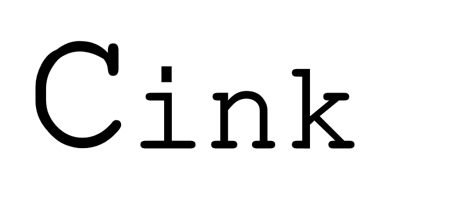

Sponsored by: ***Safe Instrument*** (https://safeinst.com/) 


**Cink is a tiny and fast in-memory cache library for embedded systems.**

Supported commands:
```
put(char *key, char *value) // put(k,v)
put_ttl(char *key, char *value, long ttl); // put (k,v) with ttl 
get(char *key); // get key
del(char *key); // revoke key
```
* How to use:
```
    put_ttl("1234567", "sample test here 0", 10);
    put_ttl("1234ABC", "sample test here 1 ", 2);
    put_ttl("1234EFG", "sample test here 2", 12);
    put_ttl("1234EFG", "sample test here 3", 25);
    put("data", "sample test here 3");

    syslog(LOG_NOTICE, "{%ld} key available in list", count_cache());

    syslog(LOG_NOTICE, "%s", get("1234567"));
    syslog(LOG_NOTICE, "%s", get("1234ABC"));

    del("1234567");
    del("1234ABC");

    syslog(LOG_NOTICE, "{%ld} key available in list", count_cache());
```
* Example @cink.c
```
 make
 cd build
 ./cink
```
*Cink is under development (for fun)

